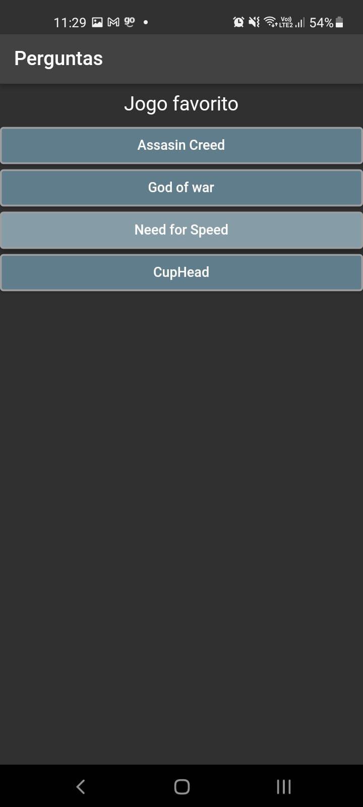
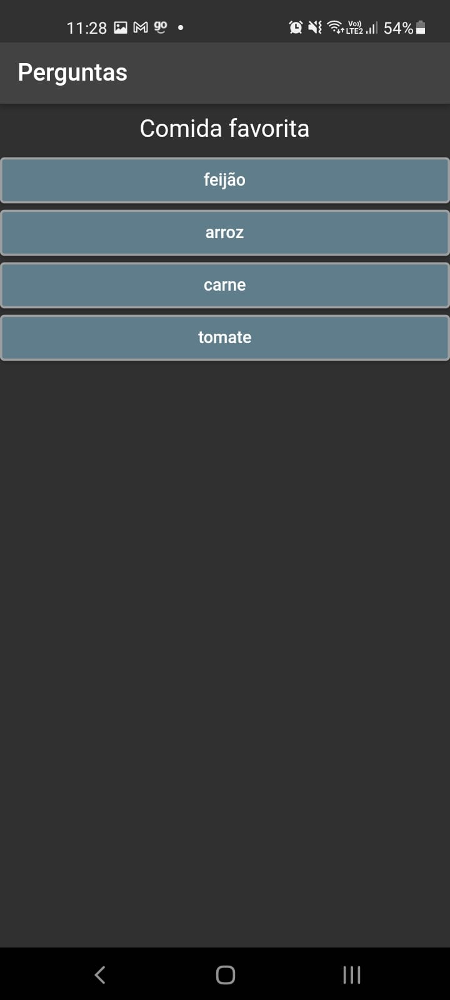
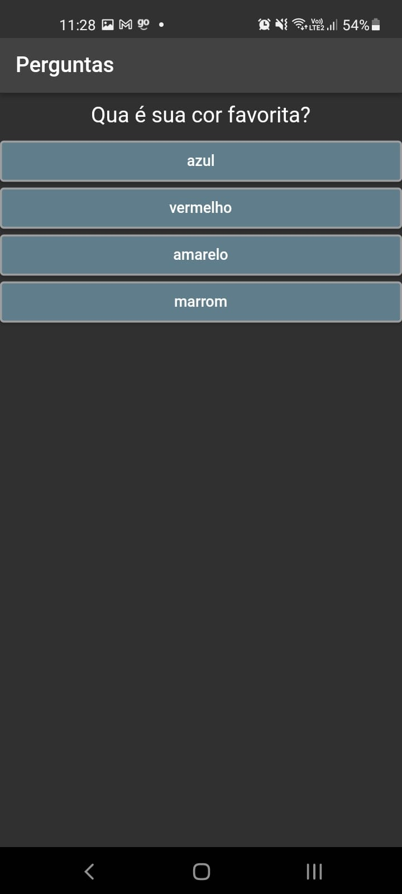
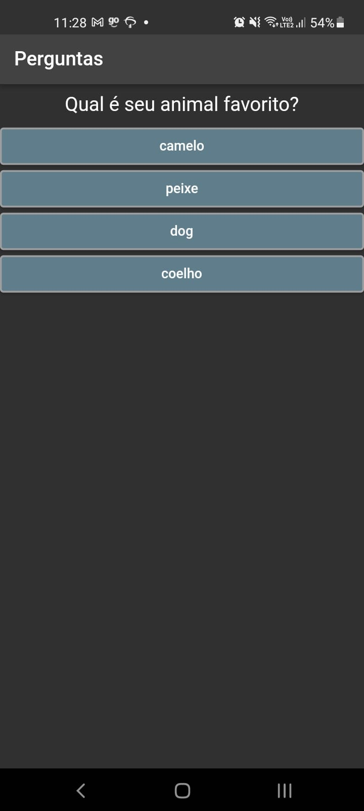
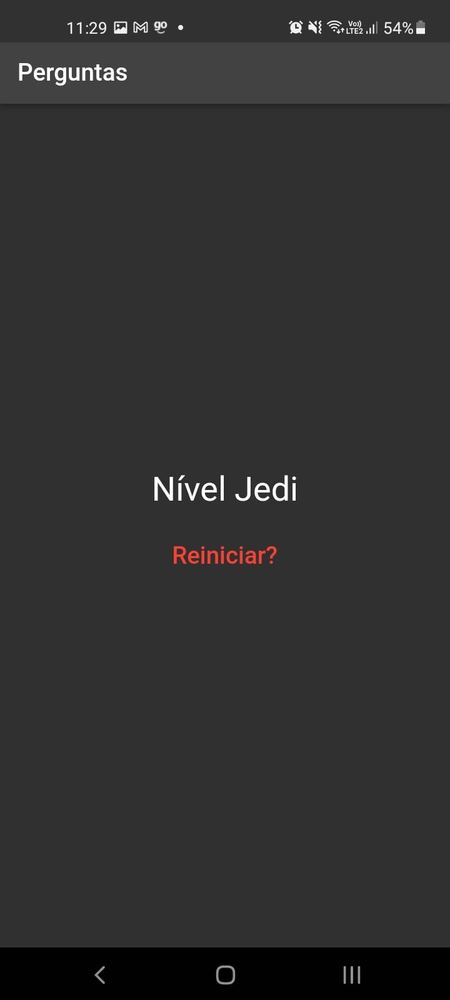

# App Perguntas

Treino

## Sobre

  Este aplicativo foi desenvolvido apenas para treinar 
programação orientada a objetos onde o elemento filho mandava
informações para seu pai.
  A forma de representar esta troca de informações, pode ser vista 
como a entrega de resultado final trazendo a pontuação total e representando seu significado.

- [Link do projeto apk](https://drive.google.com/file/d/1ABIAjJlCDWt5MIEWKgllTnh2XDdICyJe/view?usp=sharing)

Imagens: 

          
          
          
          
          

